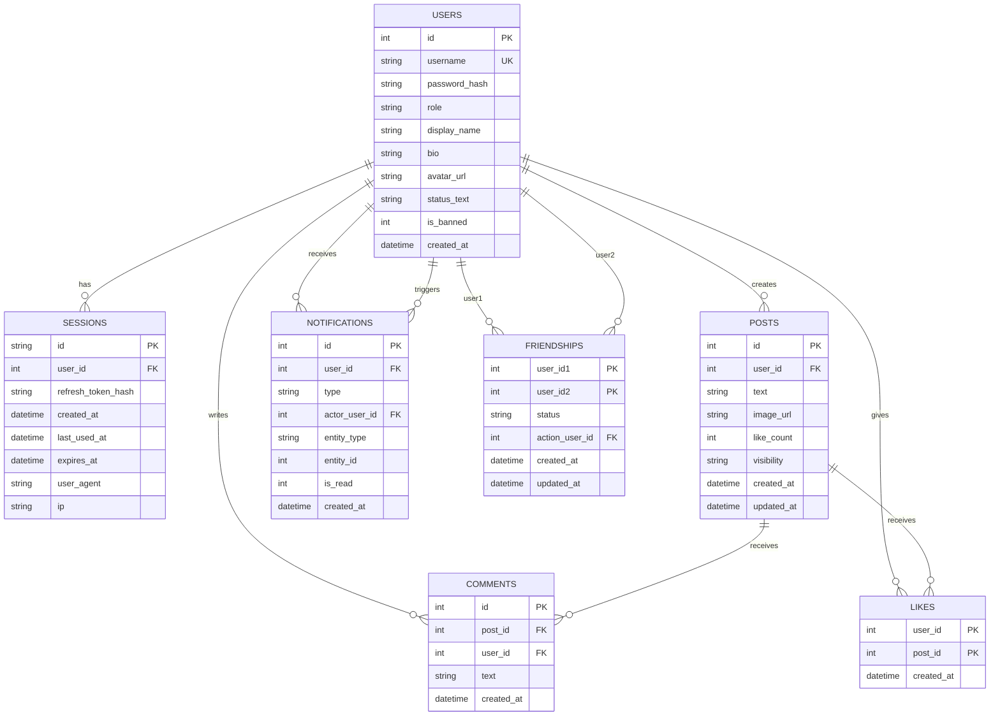

# Project Handoff

## 1. Project Summary
This project is a demo-ready social media app built with:
- Frontend: React + Vite + TypeScript + Tailwind
- Backend: Express + TypeScript
- Database: SQLite
- Realtime: Socket.IO

Main features currently implemented:
- User signup/login with access and refresh tokens
- Feed with posts, likes, and comments
- Friends system
- Post visibility controls (`public`, `friends`)
- Notifications with unread badge
- Search for users and posts
- Admin dashboard and read-only SQL console
- Realtime updates for post/like/comment activity

## 2. Current Status
The project is in a runnable demo state for local development and presentation.

Main local entry points:
- API: `http://localhost:4000`
- Web: `http://localhost:5173`

This app currently targets local/demo use rather than production deployment.

## 3. Runtime Requirements
This project is intended to run on common desktop operating systems including macOS, Linux, and Windows, provided that the required tooling is installed. Cross-platform compatibility is expected, but it should not be treated as guaranteed on every environment without verification.

Required software:
- Node.js 18 or later
- npm
- A modern web browser

Optional software:
- Docker and Docker Compose, if running the containerized setup instead of local Node.js processes

Possible build tooling requirement:
- Python 3, `make`, and a C/C++ compiler may be required on some systems when installing the `sqlite3` dependency from source

Environment requirements:
- `server/.env` must be configured
- `client/.env` must be configured
- Required server and client environment variables must be set correctly

System requirements:
- Port `4000` should be available for the backend server
- Port `5173` should be available for the frontend development server
- The machine must allow local file creation and write access because the application uses SQLite for local database storage

Functional capability requirements:
- The backend server must be able to start and run migrations
- The frontend must be able to connect to the backend API
- The frontend must be able to connect to the Socket.IO realtime service
- The application must be able to read from and write to the local SQLite database

## 4. How To Run
### Local development
1. Install dependencies:
   - `npm install`
2. Create environment files:
   - copy `server/.env.example` to `server/.env`
   - copy `client/.env.example` to `client/.env`
3. Seed demo data:
   - `npm -w server run seed:test`
4. Start both frontend and backend:
   - `npm run dev`

### Docker
1. Optional seed:
   - `docker compose run --rm server npm run seed:test`
2. Start containers:
   - `docker compose up --build`

## 5. Demo Accounts
- Admin: `admin` / `admin123`
- Demo users: `seed_user01` to `seed_user10`
- Password for demo users: `password123`

## 6. Important Repo Structure
- `client/`: React frontend
- `client/src/pages/`: page-level screens
- `client/src/components/`: reusable UI components
- `client/src/lib/`: frontend config, API helpers, realtime, types
- `server/`: Express backend
- `server/src/routes/`: API route handlers
- `server/src/db/`: SQLite connection and migration logic
- `server/src/realtime.ts`: Socket.IO setup
- `server/src/services/notifications.ts`: notification-related backend logic
- `server/migrations/`: SQL migrations
- `server/scripts/seedTestData.ts`: deterministic demo data seeding
- `scripts/dev.cjs`: starts server and client together in development

## 7. ER Model
Main entities:
- `users`
- `sessions`
- `posts`
- `comments`
- `likes`
- `friendships`
- `notifications`

Main relationships:
- One user can have many sessions
- One user can create many posts
- One user can write many comments
- One post can have many comments
- Users and posts have a many-to-many relationship through likes
- Users have a many-to-many self-relationship through friendships
- One user can receive many notifications
- One user can also act as the triggering user for many notifications

Design notes:
- `likes` is the associative table between users and posts
- `friendships` is a self-referencing associative table between two users
- `friendships` stores one row per user pair using the `user_id1 < user_id2` rule
- `notifications.entity_type` and `entity_id` are polymorphic references and are not enforced as direct foreign keys
- The `migrations` table exists for schema management and is not part of the business ER model

## 8. Environment Variables
### Server
Important variables:
- `PORT`
- `CLIENT_ORIGIN`
- `JWT_ACCESS_SECRET`
- `JWT_REFRESH_SECRET`
- `ACCESS_TOKEN_TTL_SECONDS`
- `REFRESH_TOKEN_TTL_SECONDS`
- `SQLITE_PATH`
- `ADMIN_USERNAME`
- `ADMIN_PASSWORD`

### Client
Important variables:
- `VITE_API_BASE`
- `VITE_SOCKET_URL`

## 9. Database and Migration Notes
- SQLite is used for persistence.
- Migrations run automatically when the backend starts.
- Migration files live in `server/migrations/`.
- Migrations are manually listed in `server/src/db/migrate.ts`.
- If a new migration file is added, it must also be added to the migration file list in `server/src/db/migrate.ts` or it will not run.

## 10. Seeding Notes
- `npm -w server run seed:test` resets the local database by default.
- This is useful for demos, but it will wipe existing local data.
- To avoid resetting existing data, use:
  - `npm -w server run seed:test -- --no-force`
- Seeded content is deterministic, so it is useful for repeatable demos and debugging.

## 11. Known Gaps and Risks
- There is no automated test suite set up currently.
- Root `npm run lint` only lints the client, not the server.
- The project is optimized for local/demo use rather than production hardening.
- SQLite is simple and convenient here, but it is not intended for production-scale concurrent traffic.
- Default auth secrets in the example env files are development-only values and should not be used in any real deployment.

## 12. Recommended First Tasks For the Next Maintainer
- Add backend linting and an automated test suite
- Document API behavior more formally if the project will continue beyond the course/demo phase
- Review the admin SQL console and confirm its intended access and safety boundaries
- Decide whether the app remains demo-only or should be hardened for deployment
- Add a clearer deployment or release process if production use is expected

## 13. Suggested Ownership Checklist
The next maintainer should verify the following after setup:
- Local startup works
- Seed script works
- Login and signup work
- Feed create/read/update/delete works
- Likes and comments work
- Notifications work
- Admin dashboard works
- Realtime updates work across two browser windows

## 14. Final Notes
Before making schema changes:
- Add a new SQL migration
- Register it in `server/src/db/migrate.ts`
- Test against a fresh seeded database

Before demoing:
- Reseed the database for a clean state
- Confirm the demo accounts still work
- Confirm the frontend is pointing to the correct backend URL
