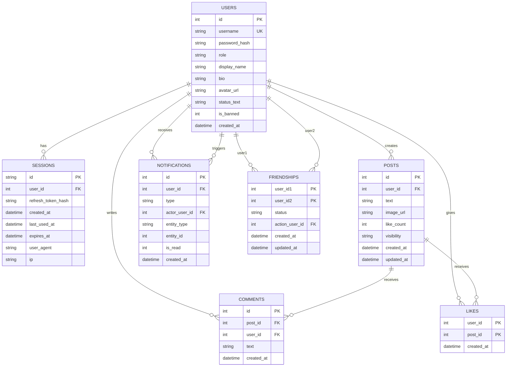

# Social Media App (SQLite + Node + React)

Demo-ready local social media app built with SQLite + Express + React + Tailwind.

Core features:
- Auth: signup/login with access + refresh tokens
- Feed: image posts via URLs, likes, comments
- Social: friends + friends-only feed scope
- Post visibility: `public` or `friends` (no `private`)
- Notifications: in-app notifications + unread badge
- Search: users + posts
- Admin: analytics dashboard + read-only SQL console
- UI: dark mode + polished design system
- Realtime: live updates for post/like/comment changes (Socket.IO)

## Prereqs
- Node.js 18+ recommended

## Runtime Requirements
This project is intended to run on common desktop operating systems including macOS, Linux, and Windows, provided that the required tooling is installed. Cross-platform compatibility is expected, but it should not be treated as guaranteed on every environment without verification.

Required software:
- Node.js 18 or later
- npm
- A modern web browser

Optional software:
- Docker and Docker Compose, if running the containerized setup instead of local Node.js processes

Possible build tooling requirement:
- Python 3, `make`, and a C/C++ compiler may be required on some systems when installing the `sqlite3` dependency from source

Environment requirements:
- `server/.env` must be configured
- `client/.env` must be configured
- Required server and client environment variables must be set correctly

System requirements:
- Port `4000` should be available for the backend server
- Port `5173` should be available for the frontend development server
- The machine must allow local file creation and write access because the application uses SQLite for local database storage

Functional capability requirements:
- The backend server must be able to start and run migrations
- The frontend must be able to connect to the backend API
- The frontend must be able to connect to the Socket.IO realtime service
- The application must be able to read from and write to the local SQLite database

## Quickstart (clone → setup → seed → run)
1) Install deps: `npm install`
2) Setup env files:
   - Server: copy `server/.env.example` → `server/.env`
   - Client: copy `client/.env.example` → `client/.env`
3) Seed demo data (wipes & resets the local DB): `npm -w server run seed:test`
4) Start both apps: `npm run dev`
   - API: http://localhost:4000
   - Web: http://localhost:5173

## Docker (easiest for others)
1) (Optional) Seed demo data (wipes & resets the DB volume): `docker compose run --rm server npm run seed:test`
2) Start containers: `docker compose up --build`
3) Open: http://localhost:5173

### Demo accounts
- Admin: `admin` / `admin123`
- Users: `seed_user01` … `seed_user10` / `password123`

## Seeding notes
- `npm -w server run seed:test` is intended for demos and is deterministic.
- By default it resets the database so each run starts from the same state.
- To keep existing data: `npm -w server run seed:test -- --no-force`
- Seeded content does not rely on external image URLs (offline-friendly).
 - The SQLite data directory is created automatically on first run.

## Scripts
- Dev (both): `npm run dev`
- Dev (server only): `npm run dev:server`
- Dev (client only): `npm run dev:client`
- Build: `npm run build`
- Lint: `npm run lint`

## Seed only an admin user (optional)
- `npm -w server run seed:admin`

## ER Model
Main entities:
- `users`
- `sessions`
- `posts`
- `comments`
- `likes`
- `friendships`
- `notifications`

Main relationships:
- One user can have many sessions
- One user can create many posts
- One user can write many comments
- One post can have many comments
- Users and posts have a many-to-many relationship through likes
- Users have a many-to-many self-relationship through friendships
- One user can receive many notifications
- One user can also act as the triggering user for many notifications

Design notes:
- `likes` is the associative table between users and posts
- `friendships` is a self-referencing associative table between two users
- `friendships` stores one row per user pair using the `user_id1 < user_id2` rule
- `notifications.entity_type` and `entity_id` are polymorphic references and are not enforced as direct foreign keys
- The `migrations` table exists for schema management and is not part of the business ER model

## Key endpoints
- Auth: `POST /api/auth/signup`, `POST /api/auth/login`, `POST /api/auth/refresh`, `POST /api/auth/logout`
- Me: `GET /api/me`, `PATCH /api/me`, `DELETE /api/me`
- Users (public profile): `GET /api/users/:username`
- Posts: `GET /api/posts/feed`, `POST /api/posts`, `PUT /api/posts/:id`, `DELETE /api/posts/:id`, `POST /api/posts/:id/like`
- Post detail: `GET /api/posts/:id`
- Comments: `GET /api/comments/post/:postId`, `POST /api/comments/post/:postId`
- Admin (admin-only): `GET /api/admin/analytics`, `POST /api/admin/sql`

## Profile editing
- Go to your profile at `/u/<yourUsername>`.
- If you're viewing your own profile, you'll see an **Edit profile** form.
- Username changes are intentionally not supported.

## Realtime
- Socket.IO server emits `event` messages for post/like/comment changes.

## Notes
- Server runs SQLite migrations automatically on startup (`server/src/db/migrate.ts`).
